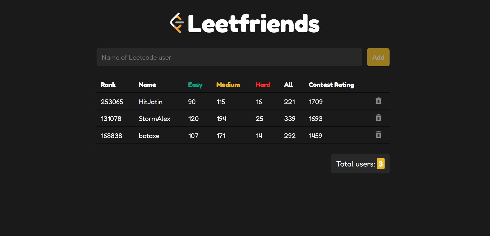

<h1 align="center">
  Leetfriends
</h1>




## Project

Project is powered by React JS and bundler is Vite.

- [x] Add the name of your leetcode friend. hence the name Leetfriends
- [x] Remove the leetcode user from the list.
- [x] Track how you rank among your peers.
- [x] Your friends are stored in your local storage.
- [x] If you enter a wrong leetcode username the list remains the same.


Installation of the dependency is done via:-

```bash
$ npm i

$ npm run dev
```